# TAXIDENT — Client Database Design Document

**Schema Version:** v2.1
**Date:** February 2026
**Storage Target:** Browser SQLite via wa-sqlite/OPFS or sql.js/IndexedDB

---

## 1. Overview

Taxident is a zero-knowledge encrypted (ZKE) SaaS application for deterministic multi-jurisdiction tax residency analysis. The client-side database (schema v2.1) is the primary workspace where users enter, store, and evaluate their tax residency data. All computation — presence counting, rule evaluation, treaty tiebreaker resolution — runs locally in the browser. The server never sees plaintext user data.

The client schema serves three purposes:

1. **Data collection** — structured entry of identity, travel presence, status modifiers (visas, tax registrations, domicile, permanent homes, employment), and residency events.
2. **Evaluation engine** — deterministic evaluation of residency rules, treaty tiebreakers, day count computation, and risk projections.
3. **Sync staging** — period-scoped tracking of local changes for encrypted upload to the server vault.

The local database runs in browser SQLite via [wa-sqlite](https://nicolo-ribaudo.github.io/nicholasgasior.com/wa-sqlite/) with OPFS (Origin Private File System) as the primary storage backend, with sql.js/IndexedDB as a fallback for browsers without OPFS support.

### Changes from v2.0 to v2.1

| Change | Detail |
|--------|--------|
| Added `_countries` cache table | Local mirror of the server `countries` table (ISO 3166-1). Synced as reference data alongside jurisdictions, rulesets, rules, and treaties. |
| All `country_code` FK constraints | Every `country_code` column across the schema now has a foreign key reference to `_countries(code)`. |
| `assertions.jurisdiction_code` FK | Now FK-constrained to `_countries(code)`. Previously unconstrained TEXT. |
| `treaty_evaluations` country code FKs | `country_a_code` and `country_b_code` now FK-constrained to `_countries(code)`. |

---

## 2. Logical Architecture

The client schema is organised into three logical layers:

### Infrastructure Layer (`_*` tables)

Tables prefixed with `_` form the local infrastructure layer. These tables are **never synced as encrypted records** to the server vault. They support the encryption machinery, sync protocol, device identity, scope key management, advisor grant tracking, and reference data caching.

- `_sync_state` — tracks local vs server version numbers and dirty flags per (vault_type, period_label) pair.
- `_reference_cache` — tracks cached versions of server reference data (countries, jurisdictions, rulesets, rules, treaties).
- `_device` — key-value store for device identity (`device_id`), account binding (`account_id`), and encryption algorithm selection (`encryption_algo`).
- `_countries` — local mirror of the server's ISO 3166-1 country reference table, serving as the FK target for all `country_code` columns.
- `_scope_keys` — derivation path metadata for each data scope (presence, status_modifiers, etc.), including temporal/non-temporal classification and period granularity.
- `_advisor_grants_local` — local mirror of outbound advisor grants for offline grant tracking and rolling window automation.

### Domain Data Layer (Sections 1–5)

User-entered and derived factual data — the primary inputs to the evaluation engine:

- **Section 1 — Identity:** nationalities and family members (non-temporal; encrypted with scope master key directly).
- **Section 2 — Presence Data:** travel intervals and family member presence records.
- **Section 3 — Status Modifiers:** visas, tax registrations, domicile declarations, permanent homes, and employment records.
- **Section 4 — Residency Events:** discrete events marking commencement or cessation of residency.
- **Section 5 — Assertions:** user-provided subjective inputs for rules that cannot be mechanically determined (e.g., centre of vital interests factors).

### Evaluation Output Layer (Sections 6–9)

Computed outputs derived from domain data and reference data pulled from the server:

- **Section 6 — Evaluation Results:** jurisdiction-level residency determinations, individual rule results, assertion linkages, and factor summaries.
- **Section 7 — Treaty Evaluations:** bilateral treaty tiebreaker evaluations and step-by-step results.
- **Section 8 — Derived Day Counts:** cached day count computations by country, period type, and calculation method.
- **Section 9 — Risk & Projections:** threshold proximity alerts, status change warnings, and what-if simulation results.
- **Section 10 — Audit Log:** client-side audit trail of all data mutations.

### No Auth Zone

The client schema has **no authentication zone**. Authentication is handled entirely server-side via WebAuthn. The client stores only a `device_id` and `account_id` in the `_device` key-value table, and derives all cryptographic keys from the master seed held in memory during a session.

---

## 3. Architecture Summary

### Period Labelling Scheme

All temporal records are tagged with a `period_label` at write time. The label format is `YYYY-QN` (e.g., `2025-Q1`). This label determines which derived encryption key protects the record when syncing to the server vault:

```
period_key = HKDF(scope_master_key, period_label)
```

Non-temporal data (identity, settings) has `NULL` for `period_label` and is encrypted directly with the scope master key without period derivation.

The `period_label` is an opaque string to the server — the server does not parse it. This design allows the client to change period granularity in future versions (e.g., monthly) without server-side schema changes.

### Sync Model

The `_sync_state` table tracks synchronisation state per (vault_type, period_label) pair:

- `local_version` — incremented on each local write within the scope.
- `server_version` — last known server version for this scope.
- `dirty` — boolean flag indicating unsynced local changes.
- `last_synced_at` — timestamp of last successful sync.

The `_scope_keys` table drives key derivation by mapping each scope name to its HKDF derivation path, temporal classification, and period granularity. During sync, the client:

1. Queries `_sync_state` for dirty scopes.
2. Derives the appropriate period key from `_scope_keys.derivation_path` + `period_label`.
3. Encrypts changed records with the period key.
4. Uploads ciphertext to the server's `encrypted_records` table.
5. Updates `_sync_state` on success.

### Country Code Resolution

All `country_code` foreign keys across the schema resolve to `_countries(code)` — a locally cached mirror of the server's `countries` table. The cached version is tracked in `_reference_cache` with `data_type = 'countries'`. On sync, the client compares its `cached_version` against the server's `reference_data_versions.current_version` and refreshes if stale.

### Advisor Grant Tracking

Advisor grants are mirrored locally in `_advisor_grants_local` for offline grant management and rolling window automation. This table is **not authoritative** — the server's `advisor_grants` table is the source of truth. The local mirror enables:

- Displaying granted scopes in the UI without a network round-trip.
- Automating rolling window management (creating new grants for incoming quarters, tombstoning old ones).
- Tracking opaque token grants for non-onboarded recipients.

---

## 4. Encryption & Key Management

The client is the **sole trust boundary** where plaintext user data and key material coexist. This section covers the client's cryptographic responsibilities.

### Key Derivation on the Client

All encryption keys are derived deterministically from a BIP39 24-word mnemonic (master seed):

```
master_seed (BIP39 24-word mnemonic)
  → HKDF("auth")                    → auth_key_seed (WebAuthn binding)
  → HKDF("scope:presence")          → presence_scope_key
      → HKDF(scope_key, "2025-Q1")  → period_key_2025_Q1
      → HKDF(scope_key, "2025-Q2")  → period_key_2025_Q2
  → HKDF("scope:status_modifiers")  → status_modifiers_scope_key
      → ...
  → HKDF("scope:settings")          → settings_scope_key (no period derivation)
```

- **Scope master keys** are derived via HKDF from the master seed with the scope name as info.
- **Period keys** are derived via HKDF from the scope master key with the `period_label` as info.
- **Non-temporal scopes** (identity, settings) use the scope master key directly — no period derivation.

The `_scope_keys` table stores the derivation path metadata (e.g., `"scope:presence"`) and temporal classification. It does **not** store key material.

### Algorithm Selection

The active encryption algorithm is stored in `_device` as a key-value pair: `encryption_algo → 'aes-256-gcm'` or `encryption_algo → 'xchacha20-poly1305'`.

Storing the algorithm name in plaintext is acceptable because it is **structural metadata** describing the ciphertext format, not key material. An attacker who knows the algorithm but not the key cannot decrypt. The algorithm identifier is also stored server-side in `encrypted_records.encryption_algo_id` for the same reason.

### Nonce Lifecycle

Each record must be encrypted with a **unique nonce** generated at write time. Nonces are stored server-side alongside ciphertext in `encrypted_records.nonce`. The client must **never reuse a nonce** under the same key.

Nonce size implications by algorithm:

| Algorithm | Nonce Size | Birthday Bound | Practical Safety |
|-----------|-----------|-----------------|------------------|
| AES-256-GCM | 96-bit (12 bytes) | ~2^48 encryptions per key | Quarterly key rotation and per-scope keys keep actual counts to a few thousand records per key — well within safe bounds. |
| XChaCha20-Poly1305 | 192-bit (24 bytes) | ~2^96 | Random nonce collision is negligible at any realistic scale. Safe to generate randomly without collision tracking. |

### Key Lifetime in Memory

Keys derived from the master seed **must not be persisted** to IndexedDB, OPFS, or any browser storage. They should be re-derived from the master seed on each session start. The master seed itself is held in memory only during the active session.

For the full key derivation hierarchy and server-side key management, see the **TAXIDENT Server Database Design Document (v3.1), Section 2**.

### Cross-Reference

For the full advisor key wrapping flow (how period keys are wrapped with advisor public keys) and grant enforcement model (how the server filters encrypted records by grant boundaries), see the **TAXIDENT Server Database Design Document (v3.1), Sections 6 and 8**.

---

## 5. Table Reference

### Section 0: Local Metadata

#### 5.0.1 `_sync_state`

**Purpose:** Tracks synchronisation state per (vault_type, period_label) pair. Each row represents one sync scope — the unit of dirty-tracking and version comparison between client and server.

| Column | Type | Constraints / Notes |
|--------|------|---------------------|
| `vault_type` | TEXT | NOT NULL. Part of composite PK. Maps to a `_scope_keys.scope_name`. |
| `period_label` | TEXT | Part of composite PK. `YYYY-QN` for temporal scopes; NULL is not used here (the PK requires both columns). |
| `local_version` | INTEGER | NOT NULL, DEFAULT 0. Incremented on each local write within this scope. |
| `server_version` | INTEGER | NOT NULL, DEFAULT 0. Last known server version for this scope. |
| `last_synced_at` | TEXT | ISO 8601 timestamp of last successful sync. NULL if never synced. |
| `dirty` | INTEGER | NOT NULL, DEFAULT 0. Boolean (0/1). Set to 1 when local changes exist that have not been synced. |

**Key Constraints:**
- **PK:** `(vault_type, period_label)`

**Indexes:** None defined (PK index is implicit).

---

#### 5.0.2 `_reference_cache`

**Purpose:** Tracks the cached version of each server reference data type. Used during sync to determine whether the local reference data mirror is stale.

| Column | Type | Constraints / Notes |
|--------|------|---------------------|
| `data_type` | TEXT | PRIMARY KEY. One of: `countries`, `jurisdictions`, `rulesets`, `rules`, `treaties`. |
| `cached_version` | INTEGER | NOT NULL, DEFAULT 0. Compared against `reference_data_versions.current_version` on the server. |
| `last_fetched_at` | TEXT | ISO 8601 timestamp of last successful fetch. NULL if never fetched. |

**Key Constraints:**
- **PK:** `data_type`

**Indexes:** None defined.

---

#### 5.0.3 `_device`

**Purpose:** Key-value store for device identity and configuration. Contains no sensitive key material — only structural metadata.

| Column | Type | Constraints / Notes |
|--------|------|---------------------|
| `key` | TEXT | PRIMARY KEY. Expected keys: `device_id`, `account_id`, `encryption_algo`. |
| `value` | TEXT | NOT NULL. Value for the key. |

**Key Constraints:**
- **PK:** `key`

**Indexes:** None defined.

**Expected Rows:**

| Key | Value | Notes |
|-----|-------|-------|
| `device_id` | UUID | Generated on first run. Unique per browser/device. |
| `account_id` | UUID | Set after server registration. |
| `encryption_algo` | `aes-256-gcm` or `xchacha20-poly1305` | Active encryption algorithm. |

---

### Section 0a: Countries Cache

#### 5.0a.1 `_countries`

**Purpose:** Local mirror of the server `countries` table (ISO 3166-1). FK target for all `country_code` columns across the client schema. Added in v2.1. Synced as reference data via `_reference_cache` with `data_type = 'countries'`.

| Column | Type | Constraints / Notes |
|--------|------|---------------------|
| `code` | TEXT | PRIMARY KEY. ISO 3166-1 alpha-2 code (e.g., `US`, `PT`). |
| `name` | TEXT | NOT NULL. Country common name. |
| `alpha3` | TEXT | NOT NULL, UNIQUE. ISO 3166-1 alpha-3 code (e.g., `USA`). |
| `numeric_code` | TEXT | ISO 3166-1 numeric code (e.g., `840`). Optional. |
| `region` | TEXT | Geographic region (e.g., `Europe`, `Asia`, `Americas`). |
| `sub_region` | TEXT | Sub-region (e.g., `Southern Europe`, `Southeast Asia`). |
| `is_eu_member` | INTEGER | NOT NULL, DEFAULT 0. Boolean (0/1): EU member state. |
| `is_oecd_member` | INTEGER | NOT NULL, DEFAULT 0. Boolean (0/1): OECD member. |
| `has_dn_visa` | INTEGER | NOT NULL, DEFAULT 0. Boolean (0/1): digital nomad visa programme available. |
| `updated_at` | TEXT | ISO 8601 timestamp. Last update from server. |

**Key Constraints:**
- **PK:** `code`
- **UNIQUE:** `alpha3`

**Indexes:**
- `idx_countries_region` — `(region)`
- `idx_countries_eu` — `(is_eu_member)` WHERE `is_eu_member = 1` *(partial)*
- `idx_countries_oecd` — `(is_oecd_member)` WHERE `is_oecd_member = 1` *(partial)*
- `idx_countries_dn_visa` — `(has_dn_visa)` WHERE `has_dn_visa = 1` *(partial)*

> **Design Decision: Partial Indexes for Boolean Flags**
> The three boolean membership columns use partial indexes that only index rows where the flag is 1. This is efficient because the `true` population is small relative to the total (~27 EU members, ~38 OECD members, ~50 DN visa countries out of ~250 total). A full index would waste space indexing the majority of rows that are 0.

---

### Section 0b: Scope Key Management

#### 5.0b.1 `_scope_keys`

**Purpose:** Stores derivation path metadata for each data scope. Drives the key derivation logic and period granularity. Does **not** store key material — only the HKDF info string and temporal classification.

| Column | Type | Constraints / Notes |
|--------|------|---------------------|
| `scope_name` | TEXT | PRIMARY KEY. Scope identifier (e.g., `presence`, `status_modifiers`, `identity`, `settings`). |
| `derivation_path` | TEXT | NOT NULL. HKDF info string (e.g., `scope:presence`). |
| `is_temporal` | INTEGER | NOT NULL, DEFAULT 1. Boolean (0/1). 1 = period-scoped (derives period keys), 0 = uses scope master key directly. |
| `period_granularity` | TEXT | NOT NULL, DEFAULT `quarterly`. Granularity label. Currently always `quarterly`. |
| `created_at` | TEXT | NOT NULL, DEFAULT `datetime('now')`. |

**Key Constraints:**
- **PK:** `scope_name`

**Indexes:** None defined.

> **Design Decision: `period_granularity` Column**
> The `period_granularity` column is stored even though it is currently always `quarterly`. This allows the client to support different granularities in future versions (e.g., monthly for high-frequency travellers) without schema migration. The server treats `period_label` as an opaque string, so granularity changes are purely client-side.

---

### Section 0c: Outbound Grant Tracking

#### 5.0c.1 `_advisor_grants_local`

**Purpose:** Local mirror of outbound advisor grants. Enables offline grant management, rolling window automation, and UI display without network round-trips. The server's `advisor_grants` table is authoritative; this is a convenience cache.

| Column | Type | Constraints / Notes |
|--------|------|---------------------|
| `server_grant_id` | TEXT | PRIMARY KEY. Matches `advisor_grants.id` on the server. |
| `recipient_type` | TEXT | NOT NULL. CHECK: `IN ('advisor_id', 'opaque_token')`. |
| `recipient_label` | TEXT | Display label for the recipient. Optional. |
| `advisor_account_id` | TEXT | Server-side advisor account ID. Set when `recipient_type = 'advisor_id'`. |
| `opaque_token_hash` | TEXT | Hash of the opaque token. Set when `recipient_type = 'opaque_token'`. |
| `vault_type` | TEXT | NOT NULL. Data scope (e.g., `presence`). |
| `period_label` | TEXT | NOT NULL. Period scope (e.g., `2025-Q1`). |
| `start_offset` | TEXT | ISO 8601 date. Server-enforced access filter start date. |
| `granted_at` | TEXT | NOT NULL. ISO 8601 timestamp. |
| `expires_at` | TEXT | Optional grant expiry timestamp. |
| `tombstoned_at` | TEXT | Set on revocation. NULL if active. |
| `rolling_window` | INTEGER | NOT NULL, DEFAULT 0. Boolean (0/1). 1 = part of an automated rolling window. |
| `window_periods` | INTEGER | Number of periods in the rolling window (e.g., 4 for ~1 year). |

**Key Constraints:**
- **PK:** `server_grant_id`
- **CHECK:** `recipient_type IN ('advisor_id', 'opaque_token')`

**Indexes:**
- `idx_grants_local_advisor` — `(advisor_account_id)`
- `idx_grants_local_vault` — `(vault_type, period_label)`
- `idx_grants_local_rolling` — `(rolling_window)` WHERE `rolling_window = 1` *(partial)*

> **Design Decision: Rolling Window Automation**
> The `rolling_window` and `window_periods` columns enable automated grant lifecycle management. When `rolling_window = 1`, the client can automatically create new grants for incoming quarters and tombstone the oldest grants to maintain a fixed window size (e.g., 4 quarters ≈ 1 year of advisor access). This reduces manual grant management burden for ongoing advisory relationships.

---

### Section 1: Identity (Non-Temporal)

#### 5.1.1 `nationalities`

**Purpose:** Stores the user's nationality/citizenship records. Non-temporal — encrypted with the identity scope master key directly (no period derivation). Tracks whether the nationality triggers citizenship-based taxation (e.g., US citizens taxed globally).

| Column | Type | Constraints / Notes |
|--------|------|---------------------|
| `id` | TEXT | PRIMARY KEY. UUID. |
| `country_code` | TEXT | NOT NULL. FK → `_countries(code)`. |
| `nationality_type` | TEXT | NOT NULL. CHECK: `IN ('citizen', 'permanent_resident', 'national')`. |
| `effective_from` | TEXT | NOT NULL. ISO 8601 date. |
| `effective_to` | TEXT | ISO 8601 date. NULL if current. |
| `citizenship_based_taxation` | INTEGER | NOT NULL, DEFAULT 0. Boolean (0/1). 1 = this nationality triggers worldwide taxation (e.g., US, Eritrea). |
| `created_at` | TEXT | NOT NULL, DEFAULT `datetime('now')`. |

**Key Constraints:**
- **PK:** `id`
- **FK:** `country_code` → `_countries(code)`

**Indexes:** None defined beyond the implicit PK index.

> **Design Decision: No `period_label` Column**
> Identity tables (`nationalities`, `family_members`) have no `period_label` because nationality is non-temporal in the encryption model. A person's citizenship does not change per quarter. These records are encrypted with the identity scope master key directly, and synced under a single non-temporal sync scope.

---

#### 5.1.2 `family_members`

**Purpose:** Stores basic profiles of family members whose presence may be relevant to tax residency determinations (e.g., spouse presence for centre-of-vital-interests tests). Contains only a display name and relationship type — no country association. Family member presence is tracked separately in `family_presence`.

| Column | Type | Constraints / Notes |
|--------|------|---------------------|
| `id` | TEXT | PRIMARY KEY. UUID. |
| `relationship` | TEXT | NOT NULL. CHECK: `IN ('spouse', 'dependent', 'partner')`. |
| `display_name` | TEXT | NOT NULL. User-assigned label. |
| `created_at` | TEXT | NOT NULL, DEFAULT `datetime('now')`. |

**Key Constraints:**
- **PK:** `id`

**Indexes:** None defined.

---

### Section 2: Presence Data

#### 5.2.1 `presence_intervals`

**Purpose:** Stores the user's travel intervals — each row is one continuous stay in a country. This is the primary input for day count calculations and mechanical residency rules (e.g., 183-day tests). Supports multiple data sources (manual entry, CSV import, API integration, system derivation) and user overrides.

| Column | Type | Constraints / Notes |
|--------|------|---------------------|
| `id` | TEXT | PRIMARY KEY. UUID. |
| `country_code` | TEXT | NOT NULL. FK → `_countries(code)`. |
| `sub_region` | TEXT | State/province for sub-national jurisdictions (e.g., `California`). |
| `arrival_date` | TEXT | NOT NULL. ISO 8601 date. |
| `departure_date` | TEXT | ISO 8601 date. NULL if currently present. CHECK: `departure_date IS NULL OR departure_date >= arrival_date`. |
| `source_type` | TEXT | NOT NULL, DEFAULT `manual`. CHECK: `IN ('manual', 'csv', 'api', 'derived')`. |
| `confidence` | TEXT | NOT NULL, DEFAULT `high`. CHECK: `IN ('high', 'moderate', 'low')`. |
| `user_override` | INTEGER | NOT NULL, DEFAULT 0. Boolean (0/1). 1 = user has manually overridden a system-derived or imported interval. |
| `override_reason` | TEXT | Free-text explanation when `user_override = 1`. |
| `notes` | TEXT | General notes. |
| `period_label` | TEXT | `YYYY-QN` period tag for encryption scoping. |
| `created_at` | TEXT | NOT NULL, DEFAULT `datetime('now')`. |
| `updated_at` | TEXT | NOT NULL, DEFAULT `datetime('now')`. |

**Key Constraints:**
- **PK:** `id`
- **FK:** `country_code` → `_countries(code)`
- **CHECK:** `departure_date IS NULL OR departure_date >= arrival_date`

**Indexes:**
- `idx_presence_country` — `(country_code)`
- `idx_presence_dates` — `(arrival_date, departure_date)`
- `idx_presence_period` — `(period_label)`

---

#### 5.2.2 `family_presence`

**Purpose:** Tracks family member presence in countries. Structurally similar to `presence_intervals` but linked to a `family_members` row rather than the user directly. Used for centre-of-vital-interests assessments where family location is a factor.

| Column | Type | Constraints / Notes |
|--------|------|---------------------|
| `id` | TEXT | PRIMARY KEY. UUID. |
| `family_member_id` | TEXT | NOT NULL. FK → `family_members(id)`. |
| `country_code` | TEXT | NOT NULL. FK → `_countries(code)`. |
| `arrival_date` | TEXT | NOT NULL. ISO 8601 date. |
| `departure_date` | TEXT | ISO 8601 date. NULL if currently present. CHECK: `departure_date IS NULL OR departure_date >= arrival_date`. |
| `source_type` | TEXT | NOT NULL, DEFAULT `manual`. CHECK: `IN ('manual', 'csv', 'api', 'derived')`. |
| `period_label` | TEXT | `YYYY-QN` period tag. |
| `created_at` | TEXT | NOT NULL, DEFAULT `datetime('now')`. |

**Key Constraints:**
- **PK:** `id`
- **FK:** `family_member_id` → `family_members(id)`
- **FK:** `country_code` → `_countries(code)`
- **CHECK:** `departure_date IS NULL OR departure_date >= arrival_date`

**Indexes:**
- `idx_family_presence_member` — `(family_member_id)`
- `idx_family_presence_country` — `(country_code)`
- `idx_family_presence_period` — `(period_label)`

---

### Section 3: Status Modifiers

#### 5.3.1 `visa_records`

**Purpose:** Stores visa records that modify the user's legal status in a country. Visa type and category affect which residency rules apply and how presence is interpreted (e.g., a tourist visa vs. a work visa may trigger different day-count thresholds).

| Column | Type | Constraints / Notes |
|--------|------|---------------------|
| `id` | TEXT | PRIMARY KEY. UUID. |
| `country_code` | TEXT | NOT NULL. FK → `_countries(code)`. |
| `visa_type` | TEXT | NOT NULL. Free-text visa type name (e.g., `D7`, `E-2`, `Tier 2`). |
| `visa_category` | TEXT | NOT NULL. CHECK: `IN ('work', 'tourist', 'investor', 'residence', 'other')`. |
| `valid_from` | TEXT | NOT NULL. ISO 8601 date. |
| `valid_to` | TEXT | ISO 8601 date. NULL if open-ended. |
| `permits_employment` | INTEGER | NOT NULL, DEFAULT 0. Boolean (0/1). |
| `notes` | TEXT | General notes. |
| `period_label` | TEXT | `YYYY-QN` period tag. |
| `created_at` | TEXT | NOT NULL, DEFAULT `datetime('now')`. |

**Key Constraints:**
- **PK:** `id`
- **FK:** `country_code` → `_countries(code)`

**Indexes:**
- `idx_visa_country` — `(country_code)`
- `idx_visa_period` — `(period_label)`

---

#### 5.3.2 `tax_registrations`

**Purpose:** Tracks tax registrations (income tax, social security, VAT) in each country. Registration status is a significant factor in some jurisdictions' residency rules and may trigger obligations independent of physical presence.

| Column | Type | Constraints / Notes |
|--------|------|---------------------|
| `id` | TEXT | PRIMARY KEY. UUID. |
| `country_code` | TEXT | NOT NULL. FK → `_countries(code)`. |
| `registration_type` | TEXT | NOT NULL. CHECK: `IN ('income_tax', 'social_security', 'vat', 'other')`. |
| `tax_identifier` | TEXT | Tax ID number (e.g., NIF, TIN, SSN). Encrypted at rest on the server. |
| `effective_from` | TEXT | NOT NULL. ISO 8601 date. |
| `effective_to` | TEXT | ISO 8601 date. NULL if active. |
| `status` | TEXT | NOT NULL, DEFAULT `active`. CHECK: `IN ('active', 'deregistered', 'pending')`. |
| `period_label` | TEXT | `YYYY-QN` period tag. |
| `created_at` | TEXT | NOT NULL, DEFAULT `datetime('now')`. |

**Key Constraints:**
- **PK:** `id`
- **FK:** `country_code` → `_countries(code)`

**Indexes:**
- `idx_tax_reg_country` — `(country_code)`
- `idx_tax_reg_period` — `(period_label)`

---

#### 5.3.3 `domicile_records`

**Purpose:** Stores domicile declarations. Domicile is a legal concept distinct from residence — it represents a person's permanent home jurisdiction under common law systems. Domicile type (of origin, of choice, deemed) affects how it is established and changed.

| Column | Type | Constraints / Notes |
|--------|------|---------------------|
| `id` | TEXT | PRIMARY KEY. UUID. |
| `country_code` | TEXT | NOT NULL. FK → `_countries(code)`. |
| `domicile_type` | TEXT | NOT NULL. CHECK: `IN ('domicile_of_origin', 'domicile_of_choice', 'deemed')`. |
| `effective_from` | TEXT | NOT NULL. ISO 8601 date. |
| `effective_to` | TEXT | ISO 8601 date. NULL if current. |
| `basis` | TEXT | Legal basis or explanation for the domicile determination. |
| `period_label` | TEXT | `YYYY-QN` period tag. |
| `created_at` | TEXT | NOT NULL, DEFAULT `datetime('now')`. |

**Key Constraints:**
- **PK:** `id`
- **FK:** `country_code` → `_countries(code)`

**Indexes:**
- `idx_domicile_country` — `(country_code)`
- `idx_domicile_period` — `(period_label)`

---

#### 5.3.4 `permanent_homes`

**Purpose:** Tracks permanent homes available to the user. "Permanent home" is a key concept in the OECD Model Tax Convention Article 4 tiebreaker test. The `continuously_available` flag is particularly important — a home that is only seasonally available may not qualify.

| Column | Type | Constraints / Notes |
|--------|------|---------------------|
| `id` | TEXT | PRIMARY KEY. UUID. |
| `country_code` | TEXT | NOT NULL. FK → `_countries(code)`. |
| `address_summary` | TEXT | Free-text address description. |
| `ownership_type` | TEXT | NOT NULL. CHECK: `IN ('owned', 'rented', 'available')`. |
| `available_from` | TEXT | NOT NULL. ISO 8601 date. |
| `available_to` | TEXT | ISO 8601 date. NULL if ongoing. |
| `continuously_available` | INTEGER | NOT NULL, DEFAULT 1. Boolean (0/1). 1 = home is continuously available (not seasonal). |
| `notes` | TEXT | General notes. |
| `period_label` | TEXT | `YYYY-QN` period tag. |
| `created_at` | TEXT | NOT NULL, DEFAULT `datetime('now')`. |

**Key Constraints:**
- **PK:** `id`
- **FK:** `country_code` → `_countries(code)`

**Indexes:**
- `idx_homes_country` — `(country_code)`
- `idx_homes_period` — `(period_label)`

---

#### 5.3.5 `employment_records`

**Purpose:** Stores employment records. Employment type and location are inputs to residency rules (some jurisdictions treat government service employees differently) and to the OECD habitual abode tiebreaker test.

| Column | Type | Constraints / Notes |
|--------|------|---------------------|
| `id` | TEXT | PRIMARY KEY. UUID. |
| `country_code` | TEXT | NOT NULL. FK → `_countries(code)`. |
| `employer_name` | TEXT | Employer name. Optional. |
| `employment_type` | TEXT | NOT NULL. CHECK: `IN ('employed', 'self_employed', 'director', 'govt_service')`. |
| `effective_from` | TEXT | NOT NULL. ISO 8601 date. |
| `effective_to` | TEXT | ISO 8601 date. NULL if current. |
| `government_service` | INTEGER | NOT NULL, DEFAULT 0. Boolean (0/1). Redundant with `employment_type = 'govt_service'` but provides a fast boolean flag for government service treaty exceptions. |
| `notes` | TEXT | General notes. |
| `period_label` | TEXT | `YYYY-QN` period tag. |
| `created_at` | TEXT | NOT NULL, DEFAULT `datetime('now')`. |

**Key Constraints:**
- **PK:** `id`
- **FK:** `country_code` → `_countries(code)`

**Indexes:**
- `idx_employment_country` — `(country_code)`
- `idx_employment_period` — `(period_label)`

---

### Section 4: Residency Events

#### 5.4.1 `residency_events`

**Purpose:** Records discrete events marking the commencement or cessation of tax residency in a jurisdiction. Distinguished from continuous presence data — a residency event is a legal transition point that may or may not coincide with physical arrival/departure.

| Column | Type | Constraints / Notes |
|--------|------|---------------------|
| `id` | TEXT | PRIMARY KEY. UUID. |
| `country_code` | TEXT | NOT NULL. FK → `_countries(code)`. |
| `event_type` | TEXT | NOT NULL. CHECK: `IN ('commence_residency', 'cease_residency')`. |
| `physical_date` | TEXT | NOT NULL. ISO 8601 date. The date of the physical event (e.g., arrival, departure). |
| `legal_effective_date` | TEXT | NOT NULL. ISO 8601 date. The date residency legally begins/ends (may differ from physical date). |
| `basis` | TEXT | Legal basis for the residency event. |
| `source` | TEXT | NOT NULL, DEFAULT `user_asserted`. CHECK: `IN ('user_asserted', 'system_derived', 'professional_advised')`. |
| `period_label` | TEXT | `YYYY-QN` period tag. |
| `created_at` | TEXT | NOT NULL, DEFAULT `datetime('now')`. |

**Key Constraints:**
- **PK:** `id`
- **FK:** `country_code` → `_countries(code)`

**Indexes:**
- `idx_residency_events_country` — `(country_code)`
- `idx_residency_events_period` — `(period_label)`

> **Design Decision: `physical_date` vs `legal_effective_date`**
> Some jurisdictions define a different legal effective date for residency changes. For example, a person may physically arrive on 15 January but residency may legally commence on 1 January of the tax year under certain rules. Both dates are stored to support accurate mechanical evaluation and to provide an audit trail when physical and legal dates diverge.

---

### Section 5: Assertions

#### 5.5.1 `assertions`

**Purpose:** Stores user-provided subjective inputs for residency rules that cannot be mechanically determined. For example, "centre of vital interests" requires the user to assert where their personal and economic ties are strongest. Assertions are decoupled from rule results and linked via the `rule_result_assertions` bridge table.

| Column | Type | Constraints / Notes |
|--------|------|---------------------|
| `id` | TEXT | PRIMARY KEY. UUID. |
| `rule_id` | TEXT | Server-side rule ID this assertion relates to. Optional — may be NULL for treaty-step assertions. |
| `treaty_tiebreaker_step_id` | TEXT | Server-side treaty tiebreaker step ID. Optional — may be NULL for rule assertions. |
| `jurisdiction_code` | TEXT | NOT NULL. FK → `_countries(code)`. Jurisdiction the assertion applies to. |
| `tax_year` | TEXT | NOT NULL. Tax year the assertion applies to (e.g., `2025`). |
| `factor_key` | TEXT | NOT NULL. Machine-readable factor identifier (e.g., `vital_interests_personal_ties`). |
| `factor_value` | TEXT | NOT NULL. The assertion value (e.g., `strong`, `weak`, `country_a`). |
| `user_statement` | TEXT | Free-text user explanation of the assertion. |
| `supporting_evidence` | TEXT | Description of evidence supporting the assertion. |
| `confidence` | TEXT | NOT NULL, DEFAULT `moderate`. CHECK: `IN ('high', 'moderate', 'low')`. |
| `professional_reviewed` | INTEGER | NOT NULL, DEFAULT 0. Boolean (0/1). 1 = a professional advisor has reviewed this assertion. |
| `reviewer_notes` | TEXT | Notes from the professional reviewer. |
| `period_label` | TEXT | `YYYY-QN` period tag. |
| `created_at` | TEXT | NOT NULL, DEFAULT `datetime('now')`. |
| `updated_at` | TEXT | NOT NULL, DEFAULT `datetime('now')`. |

**Key Constraints:**
- **PK:** `id`
- **FK:** `jurisdiction_code` → `_countries(code)`

**Indexes:**
- `idx_assertions_jurisdiction` — `(jurisdiction_code, tax_year)`
- `idx_assertions_period` — `(period_label)`

> **Design Decision: Assertions Decoupled from Rule Results**
> Assertions are stored in their own table rather than as columns on `rule_results` because:
> 1. **Reuse** — the same assertion (e.g., "my centre of vital interests is in Portugal") may support multiple rule evaluations across different jurisdictions or tax years.
> 2. **Temporal independence** — assertions may be entered before or after the evaluation runs. The user may pre-populate assertions and then trigger evaluation, or may be prompted for assertions during evaluation.
> 3. **Professional review** — assertions have their own review lifecycle (`professional_reviewed`, `reviewer_notes`) independent of evaluation timing.
> 4. **Many-to-many relationship** — one rule result may depend on multiple assertions, and one assertion may support multiple rule results. The `rule_result_assertions` bridge table models this cleanly.

---

### Section 6: Evaluation Results

#### 5.6.1 `evaluations`

**Purpose:** Stores jurisdiction-level residency determinations. Each row is one evaluation of residency status for a specific jurisdiction and tax year. Contains the final determination, confidence basis, and counts of assertion dependencies and unresolved rules.

| Column | Type | Constraints / Notes |
|--------|------|---------------------|
| `id` | TEXT | PRIMARY KEY. UUID. |
| `jurisdiction_id` | TEXT | NOT NULL. Server-side jurisdiction ID (e.g., `PT`, `US-CA`). Not FK-constrained locally. |
| `tax_year` | TEXT | NOT NULL. Tax year evaluated (e.g., `2025`). |
| `determination` | TEXT | NOT NULL. CHECK: `IN ('resident', 'non_resident', 'indeterminate')`. |
| `confidence_basis` | TEXT | NOT NULL. CHECK: `IN ('mechanical_only', 'depends_on_assertions', 'requires_professional')`. |
| `assertion_dependency_count` | INTEGER | NOT NULL, DEFAULT 0. Number of assertions the determination depends on. |
| `unresolved_rule_count` | INTEGER | NOT NULL, DEFAULT 0. Number of rules that could not be resolved. |
| `summary` | TEXT | Human-readable evaluation summary. |
| `evaluated_at` | TEXT | NOT NULL. ISO 8601 timestamp when evaluation was computed. |
| `period_label` | TEXT | `YYYY-QN` period tag. |
| `created_at` | TEXT | NOT NULL, DEFAULT `datetime('now')`. |

**Key Constraints:**
- **PK:** `id`

**Indexes:**
- `idx_evaluations_jurisdiction` — `(jurisdiction_id, tax_year)`
- `idx_evaluations_period` — `(period_label)`

---

#### 5.6.2 `rule_results`

**Purpose:** Stores individual rule evaluation results within an evaluation. Each row is the result of applying one residency rule (e.g., the 183-day statutory residence test) to the user's data.

| Column | Type | Constraints / Notes |
|--------|------|---------------------|
| `id` | TEXT | PRIMARY KEY. UUID. |
| `evaluation_id` | TEXT | NOT NULL. FK → `evaluations(id)`. |
| `rule_id` | TEXT | NOT NULL. Server-side rule ID. Not FK-constrained locally. |
| `result` | TEXT | NOT NULL. CHECK: `IN ('pass', 'fail', 'indeterminate')`. |
| `determination_type` | TEXT | NOT NULL. CHECK: `IN ('mechanical', 'structured_subjective', 'irreducibly_subjective')`. |
| `explanation` | TEXT | Human-readable explanation of the result. |
| `inputs_json` | TEXT | JSON object containing the inputs used for evaluation (e.g., `{"total_days": 185, "threshold": 183}`). |
| `threshold_comparison` | TEXT | Human-readable threshold comparison (e.g., `185 ≥ 183`). |
| `sensitivity_note` | TEXT | Note on how close the result is to the threshold (e.g., `2 days over`). |
| `period_label` | TEXT | `YYYY-QN` period tag. |
| `created_at` | TEXT | NOT NULL, DEFAULT `datetime('now')`. |

**Key Constraints:**
- **PK:** `id`
- **FK:** `evaluation_id` → `evaluations(id)`

**Indexes:**
- `idx_rule_results_eval` — `(evaluation_id)`
- `idx_rule_results_period` — `(period_label)`

---

#### 5.6.3 `rule_result_assertions`

**Purpose:** Bridge table linking rule results to the assertions they depend on. Models the many-to-many relationship between rule evaluations and user assertions.

| Column | Type | Constraints / Notes |
|--------|------|---------------------|
| `id` | TEXT | PRIMARY KEY. UUID. |
| `rule_result_id` | TEXT | NOT NULL. FK → `rule_results(id)`. |
| `assertion_id` | TEXT | NOT NULL. FK → `assertions(id)`. |

**Key Constraints:**
- **PK:** `id`
- **FK:** `rule_result_id` → `rule_results(id)`
- **FK:** `assertion_id` → `assertions(id)`
- **UNIQUE:** `(rule_result_id, assertion_id)`

**Indexes:** None beyond implicit PK and UNIQUE constraint indexes.

> **Design Decision: Bridge Table vs JSON Column**
> `rule_result_assertions` is a normalised bridge table rather than a JSON array column on `rule_results` because:
> 1. **Referential integrity** — FK constraints ensure that referenced assertions actually exist.
> 2. **Bi-directional queries** — efficiently query "which rule results depend on assertion X?" (useful when an assertion is updated and dependent evaluations need re-running).
> 3. **No JSON parsing** — SQLite's JSON functions are limited and slow. A relational join is more efficient and portable.
> 4. **UNIQUE constraint** — the `(rule_result_id, assertion_id)` uniqueness constraint prevents accidental duplicates, which a JSON array cannot enforce at the schema level.

---

#### 5.6.4 `factor_summaries`

**Purpose:** Stores structured factor summaries for rules that involve subjective determination. Provides the evaluation engine's analysis of multiple factors (e.g., personal ties, economic ties, social ties for centre-of-vital-interests), along with a guidance note and professional referral flag.

| Column | Type | Constraints / Notes |
|--------|------|---------------------|
| `id` | TEXT | PRIMARY KEY. UUID. |
| `evaluation_id` | TEXT | NOT NULL. FK → `evaluations(id)`. |
| `rule_id` | TEXT | NOT NULL. Server-side rule ID. |
| `factors_json` | TEXT | NOT NULL. JSON array of factor objects (e.g., `[{"key": "personal_ties", "weight": "strong", "evidence": "..."}]`). |
| `guidance_note` | TEXT | Human-readable guidance for the user. |
| `professional_referral` | INTEGER | NOT NULL, DEFAULT 1. Boolean (0/1). 1 = professional advice recommended for this factor set. |
| `period_label` | TEXT | `YYYY-QN` period tag. |
| `created_at` | TEXT | NOT NULL, DEFAULT `datetime('now')`. |

**Key Constraints:**
- **PK:** `id`
- **FK:** `evaluation_id` → `evaluations(id)`

**Indexes:**
- `idx_factor_summaries_period` — `(period_label)`

---

### Section 7: Treaty Evaluations

#### 5.7.1 `treaty_evaluations`

**Purpose:** Stores treaty tiebreaker evaluations. When a user is determined resident in two jurisdictions that have a bilateral tax treaty, the treaty's tiebreaker article (typically OECD Model Article 4) is evaluated to resolve dual residency.

| Column | Type | Constraints / Notes |
|--------|------|---------------------|
| `id` | TEXT | PRIMARY KEY. UUID. |
| `evaluation_id` | TEXT | FK → `evaluations(id)`. Optional — may be NULL if evaluated independently. |
| `treaty_id` | TEXT | NOT NULL. Server-side treaty ID. |
| `tax_year` | TEXT | NOT NULL. Tax year evaluated. |
| `country_a_code` | TEXT | NOT NULL. FK → `_countries(code)`. First treaty party. |
| `country_b_code` | TEXT | NOT NULL. FK → `_countries(code)`. Second treaty party. |
| `final_resolution` | TEXT | NOT NULL. CHECK: `IN ('country_a', 'country_b', 'unresolved')`. |
| `saving_clause_applied` | INTEGER | NOT NULL, DEFAULT 0. Boolean (0/1). 1 = a saving clause overrides treaty benefits. |
| `saving_clause_note` | TEXT | Explanation of saving clause impact. |
| `summary` | TEXT | Human-readable treaty evaluation summary. |
| `evaluated_at` | TEXT | NOT NULL. ISO 8601 timestamp. |
| `period_label` | TEXT | `YYYY-QN` period tag. |

**Key Constraints:**
- **PK:** `id`
- **FK:** `evaluation_id` → `evaluations(id)`
- **FK:** `country_a_code` → `_countries(code)`
- **FK:** `country_b_code` → `_countries(code)`

**Indexes:**
- `idx_treaty_eval_year` — `(tax_year)`
- `idx_treaty_eval_country_a` — `(country_a_code)`
- `idx_treaty_eval_country_b` — `(country_b_code)`
- `idx_treaty_eval_period` — `(period_label)`

---

#### 5.7.2 `treaty_step_results`

**Purpose:** Stores the result of each individual tiebreaker step within a treaty evaluation. Steps follow the OECD Model Article 4 sequence: permanent home → vital interests → habitual abode → nationality → mutual agreement.

| Column | Type | Constraints / Notes |
|--------|------|---------------------|
| `id` | TEXT | PRIMARY KEY. UUID. |
| `treaty_evaluation_id` | TEXT | NOT NULL. FK → `treaty_evaluations(id)`. |
| `treaty_tiebreaker_step_id` | TEXT | NOT NULL. Server-side step ID. |
| `step_order` | INTEGER | NOT NULL. Evaluation sequence (1-based). |
| `result` | TEXT | NOT NULL. CHECK: `IN ('resolved_to_a', 'resolved_to_b', 'inconclusive', 'not_evaluated')`. |
| `reasoning` | TEXT | Human-readable reasoning for the step result. |
| `inputs_json` | TEXT | JSON object of inputs used for this step. |
| `period_label` | TEXT | `YYYY-QN` period tag. |
| `created_at` | TEXT | NOT NULL, DEFAULT `datetime('now')`. |

**Key Constraints:**
- **PK:** `id`
- **FK:** `treaty_evaluation_id` → `treaty_evaluations(id)`

**Indexes:**
- `idx_treaty_steps_period` — `(period_label)`

---

### Section 8: Derived Day Counts

#### 5.8.1 `day_counts`

**Purpose:** Cached day count computations derived from `presence_intervals`. Each row represents a total day count for a specific country, period type, and date range. Multiple period types are supported to handle different jurisdictions' counting rules.

| Column | Type | Constraints / Notes |
|--------|------|---------------------|
| `id` | TEXT | PRIMARY KEY. UUID. |
| `country_code` | TEXT | NOT NULL. FK → `_countries(code)`. |
| `sub_region` | TEXT | State/province for sub-national counts. |
| `period_type` | TEXT | NOT NULL. CHECK: `IN ('calendar_year', 'rolling_12m', 'lookback_weighted', 'custom')`. |
| `period_start` | TEXT | NOT NULL. ISO 8601 date. Start of counting period. |
| `period_end` | TEXT | NOT NULL. ISO 8601 date. End of counting period. |
| `total_days` | INTEGER | NOT NULL. Total physical days present. |
| `deemed_days` | INTEGER | DEFAULT 0. Days deemed present under specific rules (e.g., transit days, fractional presence). |
| `partial_day_adjustments` | INTEGER | DEFAULT 0. Adjustments for partial day counting methods. |
| `calculation_method` | TEXT | NOT NULL, DEFAULT `midnight`. CHECK: `IN ('midnight', '24hr', 'jurisdiction_specific')`. |
| `computed_at` | TEXT | NOT NULL. ISO 8601 timestamp when the count was last computed. |
| `period_label` | TEXT | `YYYY-QN` period tag. |

**Key Constraints:**
- **PK:** `id`
- **FK:** `country_code` → `_countries(code)`

**Indexes:**
- `idx_day_counts_country` — `(country_code, period_type)`
- `idx_day_counts_period` — `(period_label)`

> **Design Decision: Stored Cache vs Computed on Read**
> Day counts are stored as a materialised cache rather than computed on-the-fly because:
> 1. **Performance** — day count calculations involve iterating all `presence_intervals` for a country and date range, handling overlaps, partial days, and jurisdiction-specific rules. This is expensive to recompute on every evaluation.
> 2. **Multiple period types** — each jurisdiction may require counts under different period types (`calendar_year`, `rolling_12m`, `lookback_weighted`). Pre-computing all relevant period types avoids redundant recalculation.
> 3. **Audit trail** — storing `computed_at` provides a record of when counts were last computed, supporting debugging and reconciliation.
> 4. **Cache invalidation** — the application layer is responsible for recomputing day counts when `presence_intervals` change. No schema-level trigger exists; this is intentional to keep the schema simple and avoid SQLite trigger complexity in a browser environment.

---

### Section 9: Risk & Projections

#### 5.9.1 `risk_alerts`

**Purpose:** Stores risk alerts generated by the evaluation engine. Alerts warn of threshold proximity (e.g., approaching 183 days), status changes, and treaty conflicts. Supports severity levels and acknowledgement tracking.

| Column | Type | Constraints / Notes |
|--------|------|---------------------|
| `id` | TEXT | PRIMARY KEY. UUID. |
| `country_code` | TEXT | NOT NULL. FK → `_countries(code)`. |
| `rule_id` | TEXT | Server-side rule ID that triggered the alert. Optional. |
| `alert_type` | TEXT | NOT NULL. CHECK: `IN ('threshold_proximity', 'status_change', 'treaty_conflict')`. |
| `severity` | TEXT | NOT NULL. CHECK: `IN ('info', 'warning', 'critical')`. |
| `message` | TEXT | NOT NULL. Human-readable alert message. |
| `days_to_threshold` | INTEGER | Days remaining until threshold is reached. NULL for non-day-count alerts. |
| `projected_trigger_date` | TEXT | ISO 8601 date when the threshold will be reached at current trajectory. |
| `acknowledged` | INTEGER | NOT NULL, DEFAULT 0. Boolean (0/1). 1 = user has acknowledged and dismissed the alert. |
| `period_label` | TEXT | `YYYY-QN` period tag. |
| `created_at` | TEXT | NOT NULL, DEFAULT `datetime('now')`. |

**Key Constraints:**
- **PK:** `id`
- **FK:** `country_code` → `_countries(code)`

**Indexes:**
- `idx_risk_alerts_country` — `(country_code)`
- `idx_risk_alerts_ack` — `(acknowledged)`
- `idx_risk_alerts_period` — `(period_label)`

---

#### 5.9.2 `simulations`

**Purpose:** Stores what-if simulation results. Each simulation is a named scenario with JSON-encoded parameters and results. Used for planning future travel and assessing residency impact.

| Column | Type | Constraints / Notes |
|--------|------|---------------------|
| `id` | TEXT | PRIMARY KEY. UUID. |
| `scenario_name` | TEXT | NOT NULL. User-assigned scenario name. |
| `parameters_json` | TEXT | NOT NULL. JSON object of simulation parameters (e.g., planned travel dates, hypothetical presence changes). |
| `results_json` | TEXT | NOT NULL. JSON object of simulation results (e.g., projected day counts, residency determinations). |
| `period_label` | TEXT | `YYYY-QN` period tag. |
| `created_at` | TEXT | NOT NULL, DEFAULT `datetime('now')`. |

**Key Constraints:**
- **PK:** `id`

**Indexes:**
- `idx_simulations_period` — `(period_label)`

---

### Section 10: Audit Log

#### 5.10.1 `audit_log`

**Purpose:** Client-side audit trail of all data mutations. Every create, update, delete, override, and evaluation action is logged with the entity type, entity ID, action type, and a JSON snapshot of the changes.

| Column | Type | Constraints / Notes |
|--------|------|---------------------|
| `id` | TEXT | PRIMARY KEY. UUID. |
| `entity_type` | TEXT | NOT NULL. Table name of the affected entity (e.g., `presence_intervals`, `evaluations`). |
| `entity_id` | TEXT | NOT NULL. UUID of the affected row. |
| `action` | TEXT | NOT NULL. CHECK: `IN ('create', 'update', 'delete', 'override', 'evaluate')`. |
| `changes_json` | TEXT | JSON snapshot of the changes (e.g., `{"field": "departure_date", "old": null, "new": "2025-03-15"}`). |
| `reason` | TEXT | Free-text reason for the action. |
| `period_label` | TEXT | `YYYY-QN` period tag. |
| `created_at` | TEXT | NOT NULL, DEFAULT `datetime('now')`. |

**Key Constraints:**
- **PK:** `id`

**Indexes:**
- `idx_audit_log_entity` — `(entity_type, entity_id)`
- `idx_audit_log_period` — `(period_label)`

---

## 6. Entity Relationships

### Major Relationship Chains

#### `_countries` as the Central FK Hub

The `_countries` table is the most connected entity in the schema. It serves as the FK target for 13 relationships:

- `nationalities.country_code` → `_countries(code)`
- `presence_intervals.country_code` → `_countries(code)`
- `family_presence.country_code` → `_countries(code)`
- `visa_records.country_code` → `_countries(code)`
- `tax_registrations.country_code` → `_countries(code)`
- `domicile_records.country_code` → `_countries(code)`
- `permanent_homes.country_code` → `_countries(code)`
- `employment_records.country_code` → `_countries(code)`
- `residency_events.country_code` → `_countries(code)`
- `assertions.jurisdiction_code` → `_countries(code)`
- `treaty_evaluations.country_a_code` → `_countries(code)`
- `treaty_evaluations.country_b_code` → `_countries(code)`
- `day_counts.country_code` → `_countries(code)`
- `risk_alerts.country_code` → `_countries(code)`

#### Identity → Presence Chain

`family_members` → `family_presence`: each family member can have multiple presence intervals. This chain supports the centre-of-vital-interests tiebreaker test where family location is a factor.

#### Evaluation Chain

```
evaluations ──┬── rule_results ── rule_result_assertions ──── assertions
              │
              └── factor_summaries
```

- `evaluations` → `rule_results`: one evaluation produces multiple rule results (one per rule in the ruleset).
- `rule_results` → `rule_result_assertions`: each rule result may depend on zero or more assertions.
- `assertions` → `rule_result_assertions`: each assertion may support zero or more rule results.
- `evaluations` → `factor_summaries`: one evaluation produces factor summaries for rules with subjective elements.

#### Treaty Chain

```
evaluations ── treaty_evaluations ── treaty_step_results
```

- `evaluations` → `treaty_evaluations`: a dual-residency evaluation triggers a treaty tiebreaker evaluation.
- `treaty_evaluations` → `treaty_step_results`: each treaty evaluation produces ordered step results (permanent home, vital interests, habitual abode, nationality, mutual agreement).

#### Period Sync Grouping (Logical, Not FK)

All temporal tables share a `period_label` column that logically groups them with `_sync_state` rows. This is not enforced by FK constraints — it is a logical grouping managed by the application layer. The following tables participate in period-scoped sync:

`presence_intervals`, `family_presence`, `visa_records`, `tax_registrations`, `domicile_records`, `permanent_homes`, `employment_records`, `residency_events`, `assertions`, `evaluations`, `treaty_evaluations`, `day_counts`, `risk_alerts`, `simulations`, `audit_log`.

#### Scope/Grant Linkage

`_scope_keys` logically drives both `_sync_state` (via matching `scope_name` ↔ `vault_type`) and `_advisor_grants_local` (via matching `scope_name` ↔ `vault_type`). These are logical associations, not FK-enforced.

### Entity-Relationship Diagram

```mermaid
erDiagram
    %% ============================================================
    %% TAXIDENT — CLIENT ERD v2.1
    %% Browser SQLite (wa-sqlite + OPFS / sql.js + IndexedDB)
    %% ============================================================

    %% --------------------------------------------------------
    %% 0. LOCAL METADATA
    %% --------------------------------------------------------

    _sync_state {
        TEXT vault_type PK
        TEXT period_label PK
        INTEGER local_version
        INTEGER server_version
        TEXT last_synced_at
        INTEGER dirty
    }

    _reference_cache {
        TEXT data_type PK
        INTEGER cached_version
        TEXT last_fetched_at
    }

    _device {
        TEXT key PK
        TEXT value
    }

    _scope_keys {
        TEXT scope_name PK
        TEXT derivation_path
        INTEGER is_temporal
        TEXT period_granularity
        TEXT created_at
    }

    _advisor_grants_local {
        TEXT server_grant_id PK
        TEXT recipient_type "CHECK (advisor_id|opaque_token)"
        TEXT recipient_label
        TEXT advisor_account_id
        TEXT opaque_token_hash
        TEXT vault_type
        TEXT period_label
        TEXT start_offset
        TEXT granted_at
        TEXT expires_at
        TEXT tombstoned_at
        INTEGER rolling_window
        INTEGER window_periods
    }

    %% --------------------------------------------------------
    %% 0a. COUNTRIES CACHE
    %% --------------------------------------------------------

    _countries {
        TEXT code PK "ISO 3166-1 alpha-2"
        TEXT name
        TEXT alpha3 UK "ISO 3166-1 alpha-3"
        TEXT numeric_code
        TEXT region
        TEXT sub_region
        INTEGER is_eu_member
        INTEGER is_oecd_member
        INTEGER has_dn_visa
        TEXT updated_at
    }

    %% --------------------------------------------------------
    %% 1. IDENTITY (non-temporal)
    %% --------------------------------------------------------

    nationalities {
        TEXT id PK
        TEXT country_code FK
        TEXT nationality_type "CHECK (citizen|permanent_resident|national)"
        TEXT effective_from
        TEXT effective_to
        INTEGER citizenship_based_taxation
        TEXT created_at
    }

    family_members {
        TEXT id PK
        TEXT relationship "CHECK (spouse|dependent|partner)"
        TEXT display_name
        TEXT created_at
    }

    %% --------------------------------------------------------
    %% 2. PRESENCE DATA
    %% --------------------------------------------------------

    presence_intervals {
        TEXT id PK
        TEXT country_code FK
        TEXT sub_region
        TEXT arrival_date
        TEXT departure_date
        TEXT source_type "CHECK (manual|csv|api|derived)"
        TEXT confidence "CHECK (high|moderate|low)"
        INTEGER user_override
        TEXT override_reason
        TEXT notes
        TEXT period_label
        TEXT created_at
        TEXT updated_at
    }

    family_presence {
        TEXT id PK
        TEXT family_member_id FK
        TEXT country_code FK
        TEXT arrival_date
        TEXT departure_date
        TEXT source_type "CHECK (manual|csv|api|derived)"
        TEXT period_label
        TEXT created_at
    }

    %% --------------------------------------------------------
    %% 3. STATUS MODIFIERS
    %% --------------------------------------------------------

    visa_records {
        TEXT id PK
        TEXT country_code FK
        TEXT visa_type
        TEXT visa_category "CHECK (work|tourist|investor|residence|other)"
        TEXT valid_from
        TEXT valid_to
        INTEGER permits_employment
        TEXT notes
        TEXT period_label
        TEXT created_at
    }

    tax_registrations {
        TEXT id PK
        TEXT country_code FK
        TEXT registration_type "CHECK (income_tax|social_security|vat|other)"
        TEXT tax_identifier
        TEXT effective_from
        TEXT effective_to
        TEXT status "CHECK (active|deregistered|pending)"
        TEXT period_label
        TEXT created_at
    }

    domicile_records {
        TEXT id PK
        TEXT country_code FK
        TEXT domicile_type "CHECK (domicile_of_origin|domicile_of_choice|deemed)"
        TEXT effective_from
        TEXT effective_to
        TEXT basis
        TEXT period_label
        TEXT created_at
    }

    permanent_homes {
        TEXT id PK
        TEXT country_code FK
        TEXT address_summary
        TEXT ownership_type "CHECK (owned|rented|available)"
        TEXT available_from
        TEXT available_to
        INTEGER continuously_available
        TEXT notes
        TEXT period_label
        TEXT created_at
    }

    employment_records {
        TEXT id PK
        TEXT country_code FK
        TEXT employer_name
        TEXT employment_type "CHECK (employed|self_employed|director|govt_service)"
        TEXT effective_from
        TEXT effective_to
        INTEGER government_service
        TEXT notes
        TEXT period_label
        TEXT created_at
    }

    %% --------------------------------------------------------
    %% 4. RESIDENCY EVENTS
    %% --------------------------------------------------------

    residency_events {
        TEXT id PK
        TEXT country_code FK
        TEXT event_type "CHECK (commence_residency|cease_residency)"
        TEXT physical_date
        TEXT legal_effective_date
        TEXT basis
        TEXT source "CHECK (user_asserted|system_derived|professional_advised)"
        TEXT period_label
        TEXT created_at
    }

    %% --------------------------------------------------------
    %% 5. ASSERTIONS
    %% --------------------------------------------------------

    assertions {
        TEXT id PK
        TEXT rule_id
        TEXT treaty_tiebreaker_step_id
        TEXT jurisdiction_code FK
        TEXT tax_year
        TEXT factor_key
        TEXT factor_value
        TEXT user_statement
        TEXT supporting_evidence
        TEXT confidence "CHECK (high|moderate|low)"
        INTEGER professional_reviewed
        TEXT reviewer_notes
        TEXT period_label
        TEXT created_at
        TEXT updated_at
    }

    %% --------------------------------------------------------
    %% 6. EVALUATION RESULTS
    %% --------------------------------------------------------

    evaluations {
        TEXT id PK
        TEXT jurisdiction_id
        TEXT tax_year
        TEXT determination "CHECK (resident|non_resident|indeterminate)"
        TEXT confidence_basis "CHECK (mechanical_only|depends_on_assertions|requires_professional)"
        INTEGER assertion_dependency_count
        INTEGER unresolved_rule_count
        TEXT summary
        TEXT evaluated_at
        TEXT period_label
        TEXT created_at
    }

    rule_results {
        TEXT id PK
        TEXT evaluation_id FK
        TEXT rule_id
        TEXT result "CHECK (pass|fail|indeterminate)"
        TEXT determination_type "CHECK (mechanical|structured_subjective|irreducibly_subjective)"
        TEXT explanation
        TEXT inputs_json
        TEXT threshold_comparison
        TEXT sensitivity_note
        TEXT period_label
        TEXT created_at
    }

    rule_result_assertions {
        TEXT id PK
        TEXT rule_result_id FK
        TEXT assertion_id FK
    }

    factor_summaries {
        TEXT id PK
        TEXT evaluation_id FK
        TEXT rule_id
        TEXT factors_json
        TEXT guidance_note
        INTEGER professional_referral
        TEXT period_label
        TEXT created_at
    }

    %% --------------------------------------------------------
    %% 7. TREATY EVALUATIONS
    %% --------------------------------------------------------

    treaty_evaluations {
        TEXT id PK
        TEXT evaluation_id FK
        TEXT treaty_id
        TEXT tax_year
        TEXT country_a_code FK
        TEXT country_b_code FK
        TEXT final_resolution "CHECK (country_a|country_b|unresolved)"
        INTEGER saving_clause_applied
        TEXT saving_clause_note
        TEXT summary
        TEXT evaluated_at
        TEXT period_label
    }

    treaty_step_results {
        TEXT id PK
        TEXT treaty_evaluation_id FK
        TEXT treaty_tiebreaker_step_id
        INTEGER step_order
        TEXT result "CHECK (resolved_to_a|resolved_to_b|inconclusive|not_evaluated)"
        TEXT reasoning
        TEXT inputs_json
        TEXT period_label
        TEXT created_at
    }

    %% --------------------------------------------------------
    %% 8. DERIVED DAY COUNTS
    %% --------------------------------------------------------

    day_counts {
        TEXT id PK
        TEXT country_code FK
        TEXT sub_region
        TEXT period_type "CHECK (calendar_year|rolling_12m|lookback_weighted|custom)"
        TEXT period_start
        TEXT period_end
        INTEGER total_days
        INTEGER deemed_days
        INTEGER partial_day_adjustments
        TEXT calculation_method "CHECK (midnight|24hr|jurisdiction_specific)"
        TEXT computed_at
        TEXT period_label
    }

    %% --------------------------------------------------------
    %% 9. RISK & PROJECTIONS
    %% --------------------------------------------------------

    risk_alerts {
        TEXT id PK
        TEXT country_code FK
        TEXT rule_id
        TEXT alert_type "CHECK (threshold_proximity|status_change|treaty_conflict)"
        TEXT severity "CHECK (info|warning|critical)"
        TEXT message
        INTEGER days_to_threshold
        TEXT projected_trigger_date
        INTEGER acknowledged
        TEXT period_label
        TEXT created_at
    }

    simulations {
        TEXT id PK
        TEXT scenario_name
        TEXT parameters_json
        TEXT results_json
        TEXT period_label
        TEXT created_at
    }

    %% --------------------------------------------------------
    %% 10. AUDIT LOG
    %% --------------------------------------------------------

    audit_log {
        TEXT id PK
        TEXT entity_type
        TEXT entity_id
        TEXT action "CHECK (create|update|delete|override|evaluate)"
        TEXT changes_json
        TEXT reason
        TEXT period_label
        TEXT created_at
    }

    %% ============================================================
    %% RELATIONSHIPS
    %% ============================================================

    %% Countries FK (new in v2.1)
    _countries ||--o{ nationalities : "citizenship of"
    _countries ||--o{ presence_intervals : "present in"
    _countries ||--o{ family_presence : "present in"
    _countries ||--o{ visa_records : "visa for"
    _countries ||--o{ tax_registrations : "registered in"
    _countries ||--o{ domicile_records : "domiciled in"
    _countries ||--o{ permanent_homes : "home in"
    _countries ||--o{ employment_records : "employed in"
    _countries ||--o{ residency_events : "residency in"
    _countries ||--o{ assertions : "jurisdiction"
    _countries ||--o{ treaty_evaluations : "country_a"
    _countries ||--o{ treaty_evaluations : "country_b"
    _countries ||--o{ day_counts : "counted in"
    _countries ||--o{ risk_alerts : "alert for"

    %% Identity
    family_members ||--o{ family_presence : "tracked in"

    %% Evaluation chain
    evaluations ||--o{ rule_results : "produces"
    evaluations ||--o{ factor_summaries : "summarises"
    rule_results ||--o{ rule_result_assertions : "depends on"
    assertions ||--o{ rule_result_assertions : "supports"

    %% Treaty evaluation chain
    evaluations ||--o{ treaty_evaluations : "triggers"
    treaty_evaluations ||--o{ treaty_step_results : "resolved via"

    %% Scope key drives period labelling
    _scope_keys ||--o{ _sync_state : "syncs per scope"
    _scope_keys ||--o{ _advisor_grants_local : "grants per scope"

    %% Period label groupings (logical, not FK)
    presence_intervals }o--o| _sync_state : "period sync"
    family_presence }o--o| _sync_state : "period sync"
    visa_records }o--o| _sync_state : "period sync"
    tax_registrations }o--o| _sync_state : "period sync"
    domicile_records }o--o| _sync_state : "period sync"
    permanent_homes }o--o| _sync_state : "period sync"
    employment_records }o--o| _sync_state : "period sync"
    residency_events }o--o| _sync_state : "period sync"
    assertions }o--o| _sync_state : "period sync"
    evaluations }o--o| _sync_state : "period sync"
    treaty_evaluations }o--o| _sync_state : "period sync"
    day_counts }o--o| _sync_state : "period sync"
    risk_alerts }o--o| _sync_state : "period sync"
    simulations }o--o| _sync_state : "period sync"
    audit_log }o--o| _sync_state : "period sync"
```



---

## 7. Data Integrity Notes

### ID Format
All `id` fields are TEXT with UUID expected values. No server-side auto-increment is used. UUIDs are generated client-side (e.g., `crypto.randomUUID()`) to ensure uniqueness across devices without server coordination.

### Date/Time Format
All date and time fields are TEXT in ISO 8601 format (e.g., `2025-03-15` for dates, `2025-03-15T14:30:00Z` for timestamps). No native SQLite DATE type is used. SQLite's date/time functions (`datetime()`, `date()`) are compatible with this format for comparison and arithmetic.

### Boolean Flags
Boolean values are stored as INTEGER (0/1). The following columns use this convention:

| Column | Table(s) |
|--------|----------|
| `dirty` | `_sync_state` |
| `is_eu_member` | `_countries` |
| `is_oecd_member` | `_countries` |
| `has_dn_visa` | `_countries` |
| `is_temporal` | `_scope_keys` |
| `rolling_window` | `_advisor_grants_local` |
| `citizenship_based_taxation` | `nationalities` |
| `user_override` | `presence_intervals` |
| `permits_employment` | `visa_records` |
| `government_service` | `employment_records` |
| `continuously_available` | `permanent_homes` |
| `professional_reviewed` | `assertions` |
| `saving_clause_applied` | `treaty_evaluations` |
| `professional_referral` | `factor_summaries` |
| `acknowledged` | `risk_alerts` |

### JSON Columns
The following columns store JSON-encoded data as TEXT. No SQLite JSON constraint is enforced at the schema level. Consumers **must** treat these as potentially malformed and validate before use.

| Column | Table | Expected Structure |
|--------|-------|--------------------|
| `changes_json` | `audit_log` | Object with field-level change details |
| `inputs_json` | `rule_results` | Object with evaluation inputs |
| `inputs_json` | `treaty_step_results` | Object with step inputs |
| `factors_json` | `factor_summaries` | Array of factor objects |
| `parameters_json` | `simulations` | Object with simulation parameters |
| `results_json` | `simulations` | Object with simulation results |

### Partial Indexes
Partial indexes are used for sparse boolean flags where the `true` population is small:

| Index | Condition |
|-------|-----------|
| `idx_countries_eu` | `WHERE is_eu_member = 1` |
| `idx_countries_oecd` | `WHERE is_oecd_member = 1` |
| `idx_countries_dn_visa` | `WHERE has_dn_visa = 1` |
| `idx_grants_local_rolling` | `WHERE rolling_window = 1` |

---

## 8. Client Threat Model

### OPFS/IndexedDB at Rest

An attacker with filesystem access to the browser storage directory can read the raw SQLite file. The client database is **not encrypted at rest by default**. Risk assessment by data category:

| Data Category | At-Rest Status | Risk Level | Notes |
|---------------|---------------|------------|-------|
| Domain data (presence, status modifiers, etc.) | **Plaintext locally** | **Medium** | Encrypted before server sync, but plaintext in local SQLite. Contains sensitive travel data, visa records, tax IDs. |
| Evaluation outputs | **Plaintext locally** | **Low–Medium** | Derived data. Exposes residency determinations but not raw inputs if domain data is separately protected. |
| `_device` table | Plaintext | **Low** | Contains `device_id`, `account_id`, `encryption_algo`. No key material. `encryption_algo` is structural metadata. |
| `_scope_keys` derivation paths | Plaintext | **Low** | Contains HKDF info strings (e.g., `scope:presence`). Not key material — useless without the master seed. |
| `_advisor_grants_local` | Plaintext | **Low–Medium** | Exposes which advisors have access to which periods. Does not contain wrapped key material (that lives server-side). |
| `_countries` and reference data | Plaintext | **Negligible** | Public reference data. Not sensitive. |

### In-Memory Key Exposure

The master seed and all derived keys (scope keys, period keys) exist in browser memory during an active session. They are not persisted to storage. Threats:

- **Malicious browser extensions** with access to page memory can extract keys.
- **Compromised JS context** (XSS, supply chain attack on a dependency) can read in-memory variables.
- **Browser developer tools** can inspect memory if the device is physically accessible.

Mitigation: keys should be held in the minimum number of variables for the minimum duration. Consider using `WebCrypto.subtle` key objects (non-extractable where possible) rather than raw byte arrays.

### `_device.encryption_algo` as Plaintext

Storing the encryption algorithm name in plaintext is acceptable because it is **structural metadata** describing the ciphertext format. An attacker who knows the algorithm but not the key cannot decrypt. This is consistent with Kerckhoffs's principle: a cryptosystem should be secure even if everything about the system, except the key, is public knowledge.

### Advisor Grant Metadata

`_advisor_grants_local` stores grant scope, period labels, recipient types, and token hashes in plaintext locally. An attacker with local DB access learns:
- Which advisors have been granted access.
- Which vault types and periods are shared.
- Whether grants are part of rolling windows.

They do **not** learn:
- The wrapped key material (stored server-side in `advisor_grants.wrapped_period_key`).
- The advisor's private key (held by the advisor).
- The plaintext content of any records.

Risk: **low–medium**. The metadata reveals the existence and scope of advisory relationships but not the data itself.

### Trust Boundary

The client is the **sole location** where plaintext user data and key material coexist. The server is treated as potentially compromised per the zero-knowledge model. All encryption and decryption occurs client-side. The server only ever receives ciphertext.

For the server-side threat model, including compromised-server scenarios and advisor access enforcement, see the **TAXIDENT Server Database Design Document (v3.1), Section 8**.

---

## 9. Data Lifecycle & Housekeeping

### Period Archival

When a period is closed (no longer the active quarter), the corresponding `_sync_state` row should be marked clean (`dirty = 0`) and its `local_version` / `server_version` synchronised. Local domain data for closed periods may optionally be pruned from the client database to reduce storage footprint. Encrypted records remain on the server and can be re-synced if needed.

### `audit_log` Retention

No automatic pruning is defined in the schema. Deployments must define a retention policy. Recommendation: retain audit log entries locally for the current period plus one prior period. Older entries can be pruned after confirming they have been synced to the server vault (verified via `_sync_state` for the audit_log vault type).

### Evaluations on Ruleset Supersession

When the server publishes a new ruleset version (transitioning the old ruleset's status from `active` to `superseded`), prior evaluation results remain valid as **snapshots** of the evaluation under the previous ruleset. They should **not** be deleted. `rule_results.rule_id` references the specific rule that was current at evaluation time. Users should re-evaluate under the new ruleset to get updated determinations, but historical evaluations provide an audit trail of how determinations evolved.

### `day_counts` Cache Invalidation

`day_counts` is a derived cache computed from `presence_intervals`. It must be recomputed whenever:

- A `presence_intervals` row is created, updated, or deleted.
- The `calculation_method` for a jurisdiction changes.
- A new period type is required for a jurisdiction.

No invalidation trigger exists in the schema. The **application layer** is responsible for detecting stale counts and triggering recomputation. This is intentional — SQLite triggers in a browser environment add complexity and are difficult to debug.

### `simulations` Cleanup

Simulation results are ephemeral what-if scenarios. They may or may not be synced to the server vault. Implement a local retention policy to prevent unbounded growth. Recommendation: keep the last 20 scenarios per user, deleting oldest first. Alternatively, allow users to "pin" important simulations and auto-prune unpinned scenarios older than 90 days.

---

## 10. Versioning & Changelog

| Version | Change |
|---------|--------|
| v2.0 | Initial client schema. |
| v2.1 | Added `_countries` cache table (ISO 3166-1). Added FK constraints from all `country_code` columns to `_countries(code)`. `assertions.jurisdiction_code` and `treaty_evaluations` country codes now FK-constrained. |
| v2.2 (planned) | TBD |
